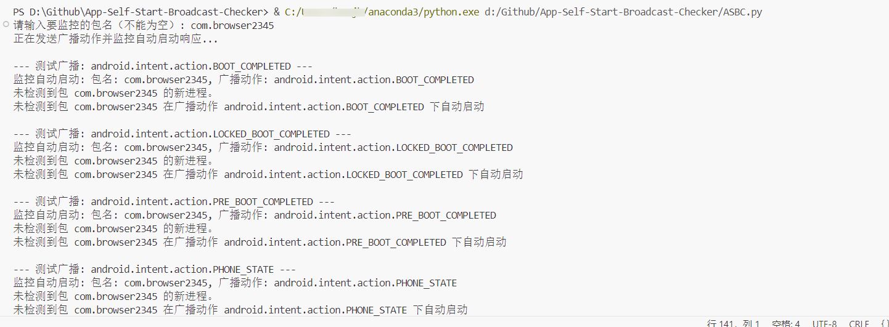
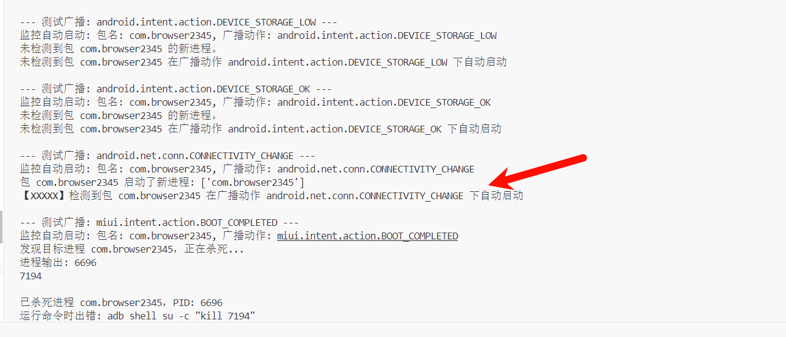

# 应用自启动广播检查器
发送广播数据包以检查应用程序自启动

# 原理
部分安卓app会监听系统中一些广播包，比如开机，换网等，检测到这些广播包后，app会启动自身的服务。
该脚本通过adb命令发送一些广播包，通过ps命令查看系统相关进程是否有被启动，从而检测应用是否通过监听系统广播启动自身服务。

脚本核心adb命令如下：

```
#给指定应用发送开机广播
adb shell su -c "am broadcast -a android.intent.action.BOOT_COMPLETED -p com.example.app"

#给查看系统进程，确定有无新增进程
adb shell su ps

# 查看指定应用的进程id
adb shell su pgrep com.example.app

#杀死指定进程
adb shell su kill id

```


# 使用方法
1、确保安卓终端具备root权限，并安装adb工具。
2、确保adb命令能够正常运行，并连接到手机。
3、通过mt管理器或者其他方法，确定被测试app的包名。
4、运行脚本，输入被测试app的包名，并等待脚本执行完毕。






