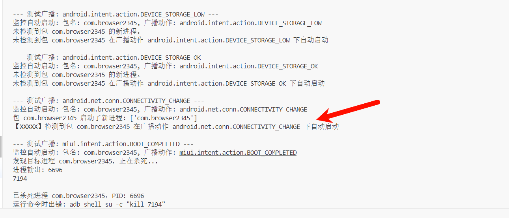

# App Self-Startup Broadcast Checker
Send broadcast packets to check application self-startup.

# Principle
Some Android apps listen for certain broadcast packets from the system, such as booting, network changes, etc. When these broadcast packets are detected, the app starts its own service. This script sends some broadcast packets via adb commands and checks if there are any newly started processes on the system using the ps command, which helps to detect whether the app has started its service by listening to system broadcasts.

The core adb commands of the script are as follows:
```
# Send boot completed broadcast to a specified app
adb shell su -c "am broadcast -a android.intent.action.BOOT_COMPLETED -p com.example.app"

# Check system processes to determine if any new processes are present
adb shell su ps

# Check the process ID of the specified app
adb shell su pgrep com.example.app

# Kill the specified process
adb shell su kill <id>
```

# Usage
1. Ensure that the Android terminal has root privileges and that the adb tool is installed.
2. Ensure that the adb command can run normally and is connected to the phone.
3. Use MT Manager or other methods to determine the package name of the app being tested.
4. Run the script, input the package name of the app being tested, and wait for the script to complete.



